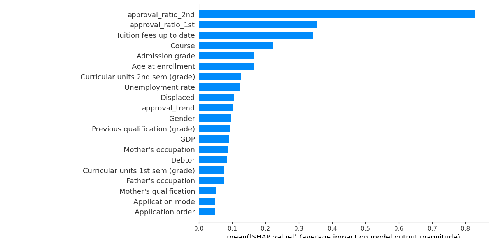

# 🎓 Student Dropout Prediction using Machine Learning

## 📌 Problem Statement
Student dropout is a major challenge for educational institutions.  
This project builds a machine learning system to predict whether a student is at risk of dropping out based on academic, demographic, and performance features.

The goal is to enable early intervention strategies and improve student retention rates.

---

## 📊 Dataset
Source: UCI Machine Learning Repository  
Predict Students Dropout and Academic Success  
https://archive.ics.uci.edu/dataset/697/predict+students+dropout+and+academic+success

The dataset contains academic, socioeconomic, and enrollment-related features for students.

---

## 🛠 Tech Stack
- Python
- Pandas
- NumPy
- Scikit-learn
- XGBoost
- SHAP (Model Explainability)
- Matplotlib

---

## 🔎 Approach

1. Data Cleaning & Preprocessing
2. Feature Engineering
3. Baseline Model Training
4. XGBoost Model Optimization
5. Model Evaluation
6. SHAP-based Interpretability Analysis

---

## 📈 Model Performance (XGBoost)

Classification Report:

| Class     | Precision | Recall | F1-Score |
|-----------|-----------|--------|----------|
| Dropout   | 0.80      | 0.75   | 0.77     |
| Enrolled  | 0.54      | 0.45   | 0.49     |
| Graduate  | 0.81      | 0.90   | 0.85     |

- Overall Accuracy: **77%**
- Macro Average F1: **0.71**
- Weighted Average F1: **0.76**

### 🔎 Key Insight
The model achieves strong performance in identifying **Dropout students (F1 = 0.77)**, which is the most critical class for early intervention.

---

## 📂 Project Structure

data/
app.py
train_xgboost.py
train_baseline.py
feature_engineering.py
shap_explain.py
feature_importance.py
requirements.txt

---

## ▶️ How to Run

1. Install dependencies:

pip install -r requirements.txt

2. Run model training:

python train_xgboost.py

3. Run the application:

python app.py

---

## 📈 Model Interpretability

The model uses SHAP to explain feature importance and prediction contributions.

---

## 🎯 Impact

This system can help institutions:
- Identify at-risk students early
- Allocate academic support resources efficiently
- Improve overall graduation rates